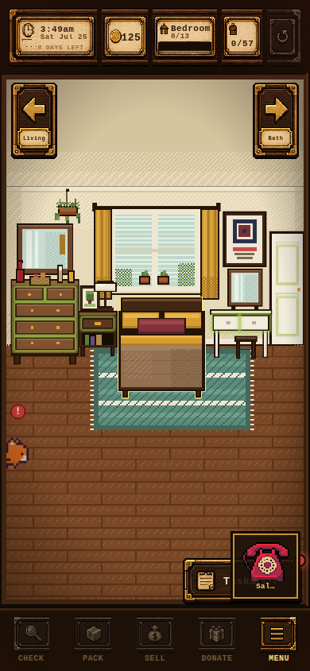
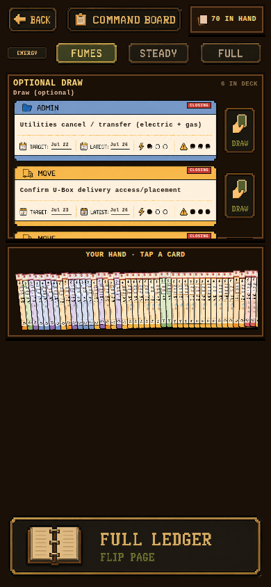
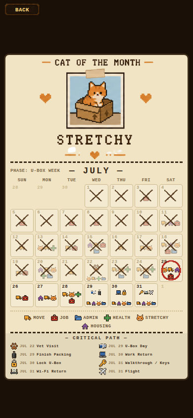

# Redesign review — first read by a new model

**Reviewer:** [Claude Code / **Opus 5**] — new to this project, no prior sessions.
**Date:** 2026-07-25 (T−6 to the flight) · **Branch:** `claude/game-redesign-recommendations-flsc1o`
**Method:** read `AGENTS.md` → `FINISH_PLAN.md` → `HANDOFF.md` → the engine files
(`schedule.js`, `tasks.js`, `session.js`, `movePhase.js`) → ran the live build at
390×844 (Vite + Playwright) and walked every screen → verified each claim by
executing the real scheduler against the real `INITIAL_TASKS`.

Every number below is measured, not estimated. Repro lines are included so the
next agent can check me rather than trust me.

> ### ⚠ Provenance — read before quoting any number here
>
> **These measurements are against a fresh install** — seed `INITIAL_TASKS`, no
> save. A headless browser has empty `localStorage`, so the live build I walked
> was a day-one game, not Eloisa's.
>
> Her device has a **curated ledger**: cards marked done, dates edited in the
> Ledger, criticality overridden, things archived. `mergeTasks` also treats saved
> membership as canonical (`save.js:136`), so her list may not even contain the
> same 180 cards. **Every count below — 69, 127, 79, 177, 145, 0/57 — describes
> the seed, not her game.** Her real numbers are almost certainly smaller.
>
> **What that does and doesn't change** is spelled out in
> [Part 0](#part-0--what-survives-her-save-and-what-doesnt). Short version: the
> structural findings are code facts and hold for any dataset; the *magnitudes*
> are seed-conditioned and need re-running.
>
> **To re-run everything against the real save**, from the repo root:
> ```bash
> node docs/design/tools/hand-audit.mjs my-save.json 2026-07-25
> ```
> (Settings → "Copy canonical mobile save" → paste into `my-save.json`.
> Read-only; run with no arguments to reproduce this document's baseline.)

> **Identity note for the ledger:** I claimed the `claude_opus` slot, which is
> described in `artifacts/agent_ledger.json` as Opus 4.8. I am **Opus 5**, a
> different model. Advisory-only work, no game code touched, no locks held.
> Eloisa may want a separate ledger key.

---

## Verdict in one paragraph

The craft here is genuinely good and the concept is right. Six rooms, the
landline, the Body Board, the wall calendar, the audio design — these are the
work of someone with taste, and they are not the problem. The problem is that
the **productivity engine has no way to lose**. Tasks enter the deck and only
ever leave by being completed. Nothing decays, nothing gets triaged out,
nothing is ever declared "not happening." Because of that, every calming
mechanism the design promises — the energy check-in, the small honest hand, the
pressure meter, FINAL CALL — inverts into its opposite in exactly the final week
it was built for. On a **Fumes** day today the game deals **69 mandatory cards**
against a design budget of 3. That is the whole review. Everything else is
detail.

---

## Part 0 — What survives her save, and what doesn't

Because the measurements are seed-conditioned, here is the honest split. Nothing
in the left column depends on how much Eloisa has done; everything in the right
column needs `hand-audit.mjs` re-run before it is quoted at her.

### Holds for any dataset — these are code facts

| # | Finding | Why it's save-independent |
|---|---------|---------------------------|
| M2 | **Energy never changes the bound hand.** | `isBoundToday` takes no energy argument at all (`schedule.js:191`). `dealDailyHand` computes `bound` before energy is consulted; energy only gates `offerEligible` and the quota. Fumes and Full produce the same forced hand **by construction**, for every possible save. |
| M2b | **Two incompatible definitions of "a day's work" ship together.** | `ENERGY_BUDGET {3,6,9}` vs `calculateTierQuotas`' remaining-effort ÷ remaining-days. Both in source. |
| M1b | **No triage verb exists.** | Nothing in the engine ever proposes archiving, and nothing decays a card whose window closed. `archived` is reachable only by manual Ledger tap. |
| M1c | **`buildMinimumSchedule` is dead.** | Exported, never called. `grep`-verifiable. |
| M4 | **Decision branches never resolve.** | `branchOptions` / `nextTaskOnComplete` normalized at `schedule.js:69-70`, read nowhere. Completing a `*_decide` card cannot archive the losing branch, in any save. |
| A2 | **Both fan renderers break above ~8 cards.** | Pure geometry. Apartment fan: card width clamps at 40px, step doesn't (`BedroomSlice.jsx:3388`). Board hand: 8px step floor under `overflow: hidden` (`Screens.jsx:1239`). Her hand size decides *whether she hits it*, not whether it's broken. |
| A1 | **~62% of the apartment screen is manufactured filler.** | Layout code (`BedroomSlice.jsx:4540`), independent of task data. |
| A3, A4, A6, A8 | Void empty states · emoji icons under `pixelated` · nine data points per Ledger row · lane colour drift | All chrome. No task data involved. |
| A5 | **Calendar X's every past day regardless of outcome.** | The mark is drawn from `isPast`, which is date arithmetic (`movePhase.js:222`). It cannot distinguish a day you cleared from a day you lost. |

### Needs re-running before it's quoted

| Claim (seed value) | Why her number differs |
|--------------------|------------------------|
| 69 bound cards / 103 effort today | Every card she's marked done leaves the pool |
| 127 cards on flight day | Same |
| 79 tasks in FINAL CALL at once | Same |
| Pressure pinned 3 from Jul 12 | Pinned only while ≥1 real crit-2 card sits past-latest. If she's cleared or archived them, it falls — and the meter is honest after all |
| "177 open · 145 · 19 · 13" badges | Direct open-counts |
| 0/57 packed, 0/13 bedroom | Fresh-install artifact; she has packed things |
| 42/180 (23%) world-bound | Ratio is authored in `tasks.js` so it's roughly stable, but the *open* count shifts |

**The one that could genuinely flip a ticket:** if her real hand is already
single-digit, "cap the hand" drops from urgent to structural — worth doing before
the *next* move, not this week. **"Fix the fan math" does not flip**; it is a
geometry bug at any count above about eight, and the clipped `T…sk…` next to the
Sal widget is visible on a fresh install, which means it is visible on hers too.

---

## Part 1 — Mechanical

### M1. The daily hand inverts under deadline · **THE headline**

`dealDailyHand` binds any open task where `latestDate <= today && criticality >= 2
&& !selfTarget` (`schedule.js:191`). Bound cards cannot be declined by the pace
picker. With 180 dated tasks on a fixed July calendar, "past its latest date"
becomes the majority state, and the bound hand grows monotonically toward the
move:

| Day | Bound cards on a **Fumes** day | Bound effort | Fumes budget (design intent) |
|-----|-------------------------------|--------------|------------------------------|
| Jul 5 | 0 | 0 | 3 |
| Jul 12 | 2 | 2 | 3 |
| Jul 19 | 29 | 48 | 3 |
| **Jul 25 (today)** | **69** | **103** | **3** |
| Jul 29 | 103 | 152 | 3 |
| Jul 31 (flight day) | **127** | **191** | 3 |

Repro:

```bash
cd artifacts/pack-it-up/src && node -e "
Promise.all([import('./tasks.js'),import('./schedule.js')]).then(([T,S])=>{
  for (const d of [5,12,19,25,29,31]) {
    const h = S.dealDailyHand(T.INITIAL_TASKS,'fumes',new Date(2026,6,d));
    console.log('Jul',d,'→',h.boundTotal,'cards /',h.boundEffort,'effort');
  }});"
```

The design's own words are "the Board is today's hand." A 69-card hand is not a
hand, it is the deck with a different label. And the shape of the curve is the
cruel part: the app is calmest when the move is far away and screams loudest on
flight day, which is the one morning it should be showing four things.

**Root cause is structural, not a bug.** There is no verb for *giving up on
something*. `status` supports `pending / active / done / dismissed / archived`,
and the Ledger has an Archive button — but nothing in the engine ever proposes
archiving, and nothing decays a card whose moment has passed. A moving app that
cannot say "this one isn't happening, let it go" will always end in this state.

**Recommendation — three changes, in order:**

1. **Hard-cap the hand.** The hand is `min(bound, N)` where N ≈ 3/5/7 by energy,
   ranked by `compareTaskUrgency`. Everything else goes to a single honest line:
   *"41 more past their latest date — open the Ledger."* This is a ~10-line
   change in `dealDailyHand` and it fixes the acute symptom today.
2. **Add a triage verb.** A card whose `latestDate` passed by more than *k* days
   without progress gets offered for one-tap **Let it go** (→ `archived`, with
   an in-world line — this is Sal's or the Desk's voice, not a dialog box). Give
   the player the dignity of deciding what dies instead of drowning them in
   things that already died.
3. **Make the Fumes floor real.** `buildMinimumSchedule` — the ~100-line
   whole-card backward scheduler, the most sophisticated thing in the codebase
   and the one that would actually produce a defensible 3-effort day — is
   **exported and never called** (`grep -rn buildMinimumSchedule src/` → only
   its own definition and the comments referencing it). Either wire it into
   `dealDailyHand` as the fumes floor it was written to be, or delete it. Right
   now it is load-bearing in the docs and dead in the build.

### M2. The energy check-in does nothing to the hand

Fumes / Steady / Full is the emotional center of the design — the app asking
"how much have you got today?" Measured today, all three answer identically:

| Energy | Bound (forced) | Offers | Quota | `ENERGY_BUDGET` intent |
|--------|----------------|--------|-------|------------------------|
| Fumes | 69 | 6 | 103 | 3 |
| Steady | 69 | 34 | 120 | 6 |
| Full | 69 | 59 | 135 | 9 |

Energy changes only the size of the *optional draw pile*. The mandatory hand is
byte-identical across all three. Telling the game you are on fumes and being
handed 69 cards is worse than not being asked — it teaches the player the app
does not listen.

Separately, `calculateTierQuotas` divides all remaining effort by all remaining
days (`schedule.js:364`), so it returns **{fumes: 34, steady: 120, full: 135}**
while `ENERGY_BUDGET` — the constant that actually encodes the design intent —
says `{3, 6, 9}` and is used only as a day-capacity inside the dead scheduler.
Two incompatible definitions of "a day's work" ship side by side. Pick one.
I recommend `ENERGY_BUDGET` wins and the quota math becomes advisory copy
("at this pace you'd need ~18/day — that isn't happening; here's what matters").

### M3. The pressure meter is a constant

`taskPressure` returns 3 the moment *any* real crit ≥ 2 task hits FINAL CALL
(`tasks.js:460`). That rule is defensible in isolation and was deliberately
chosen in the Jul 13 fix. Against this dataset it evaluates to:

```
Jul  1–10 → 1    Jul 11 → 2    Jul 12–31 → 3 3 3 3 3 3 3 3 3 3 3 3 3 3 3 3 3 3 3 3
```

Pinned at maximum for the final 20 days — the exact failure the Jul 13 session
set out to fix. The mechanism changed; the outcome did not, because the data
makes the boolean permanently true. A meter that cannot fall is decoration, and
it currently drives the Overview bar, the vignette, and Stretchy's mood.

**Recommendation:** pressure should measure *today* against *today's capacity*,
not the existence of any late thing — e.g. `bound effort for today / energy
budget`, clamped 0–3. It falls when you clear the day. That single change makes
the bar a reward surface instead of an alarm, and it makes Stretchy calm down
when you actually help him, which is the entire emotional promise of that cat.

Also: 79 of 180 tasks are simultaneously in **FINAL CALL** status today. A badge
79 things share communicates nothing. Cap the loud states — FINAL CALL should be
rare enough to mean something.

### M4. Decision branches both live in the deck

`c_scratch_keep` ("Pack/load scratching post (**keep branch**)") and
`c_scratch_donate` ("Donate scratching post (**donate branch**)") are both open,
both dated, both counted, both shown on the Stretchy screen — for a decision the
player has not made yet. Same for the cat tree. `normalizeTask` reserves
`branchOptions` and `nextTaskOnComplete` fields for exactly this
(`schedule.js:69-70`) and **nothing in the codebase reads either one**.

The seams show to the player: the Stretchy screen currently reads *"Coming up
for him (19 noted)"* and then lists mutually exclusive futures as if both are
chores. Wire the branch resolution — completing `c_scratch_decide` should
archive the losing branch — or fold the pair into one card that asks the
question. Small fix, disproportionate honesty payoff.

### M5. The apartment and the ledger are joined at 23%

- 42 of 180 tasks carry a `binding` to the world (`apartment_item` 20,
  `inventory_collection` 17, `packing_requirement` 3, health 2).
- Of the 82 `move` tasks, **35** are bound. The other 47 are text.

So the beautiful part of the game — walking rooms, tapping furniture, packing —
advances less than a quarter of the plan. The rest is a to-do list wearing the
game's clothes. This is the split-brain a player feels as *"why am I doing this
in a game instead of Notes?"*

I am **not** recommending binding all 180 — most admin genuinely has no
apartment referent, and forcing it would be worse. I am recommending the
opposite: make the split explicit and stop pretending it isn't there. Two decks,
two verbs, one calendar. The apartment deck is *touched by hands*; the desk deck
is *called, filed, stamped*. Right now they are visually identical cards in one
undifferentiated pile of 180, which is why the ledger feels like homework.

### M6. Room progress and real progress have quietly diverged

The HUD reads `0/57` boxes and `Bedroom 0/13` on a fresh save six days out. That
is correct behavior for a fresh save, but it exposes the design gap: there is no
relationship between *"57 packable objects"* and *"the U-Box is full enough."*
The packing game's win condition is "touch everything," which is not the real
win condition and cannot be, six days out. Consider a **U-Box capacity model** —
the pile fills, the truck has a volume, and "what rides / what goes / what gets
donated" becomes the actual game. That is the version of this app that is a
*game* rather than a checklist with sprites. It is also the single biggest
design opportunity in the codebase and explicitly **not** a this-week change.

---

## Part 2 — Aesthetic

The pixel work is the strongest thing here. What follows is about layout,
hierarchy, and consistency — not craft.

### A1. Half the phone screen is procedurally-generated emptiness

The stage is 960×720 (landscape) rendered into a 390×844 portrait phone. The
mobile path resolves this by manufacturing filler: it *"continue[s] the floor
downward so the room fills the tall viewport"* and adds *"enough ceiling that the
wall/floor line lands near mid-screen"* (`BedroomSlice.jsx:4540-4546`).

The result, measured on the live build: **the top ~22% is blank wall and the
bottom ~40% is blank floor.** Every interactive object in the apartment is
compressed into a horizontal band in the middle. On the Office this is starkest —
a full third of the screen is unbroken brick.

Three ways out, cheapest first:

1. **Use the floor.** It is the natural home for the box pile, the packed-crate
   stacks, Stretchy, and the hand fan — all of which currently fight for the
   bottom-right corner. The floor is not wasted space, it is *unclaimed staging
   area*. This is a layout change, not an art change.
2. **Crop to a taller room.** Author rooms at portrait aspect, accepting that the
   desktop path letterboxes. Phone is the canonical device (the docs say so);
   design for it.
3. **Zoom in further and let the room scroll horizontally.** Furniture reads
   bigger, taps get easier, and the pan gesture already exists.

I'd ship (1) now and hold (2) until after the move.



### A2. The hand fan is broken at real card counts · **ship-blocking**

Both fan renderers assume a small hand and fail without a cap.

- **Apartment fan** (`BedroomSlice.jsx:3388-3398`): card width shrinks toward a
  40px floor, but the *step* does not — `fanStep = max(14, round(cardW*0.48))`.
  At 70 cards the fan spans `40 + 69×19 ≈ **1351px**` on a 390px screen. It runs
  straight off the right edge, and what's left on screen collides with the Sal
  contact widget — in the live build the tasks button reads as clipped garbage
  (`T…sk…`) in every single room.
- **Board hand** (`Screens.jsx:1239-1252`): step has a hard 8px floor and the
  container is `overflow: hidden`. At 70 cards the hand renders as a comb of
  ~9px slivers and **the tail of your own hand is clipped off the panel — those
  cards cannot be tapped at all.**

Fix is small and mechanical: derive step and width from one clamp, cap rendered
cards at ~7 with a `+63` overflow chip, and let the Ledger own the long tail.
This is a **Composer-sized** ticket and it should not wait for the redesign.



### A3. Empty states are voids

Three screens present a large expanse of near-black brown as their primary
state:

- **Command Board before a pace is picked** — ~70% of the screen is empty
  (already on the plan as a Codex nit; it is worse than "unfinished," it is the
  first thing a new day shows you).
- **Desk → FILED** — "Nothing filed yet" over ~35% empty wood.
- **Inventory** — "Nothing packed yet. The boxes are waiting." over ~75% empty.

This game has *the best empty-state material imaginable*: an apartment, a cat, a
calendar, and a real deadline. Every void should be a prop — the empty outbox
tray drawn as an actual empty tray, the inventory as an open flat-packed box,
the pre-pick board showing yesterday's closed-out day. Never dead pixels.

Related copy bug: **Inventory's only button reads "Manage this room's items
(unpack / take back)"** — a parenthetical disambiguating a verb the player never
learned. It should say what it does.

### A4. Two art styles are fighting

The Overview tiles use icon PNGs (folder, stethoscope, box, money bag, gear)
that are anti-aliased, glossy, emoji-derived art displayed under
`image-rendering: pixelated` (`Screens.jsx:926-933`, render at `:1056`).
`pixelated` prevents smoothing; it does not convert soft art into pixel art. Set
against the flat 4px-cell palette of the rooms and the genuinely hand-made cat,
they read as clip art dropped into a handmade game — and the Overview is the
screen most likely to be someone's first impression.

`TASK_CATEGORIES` also carries raw emoji (`📦 🏠 💼 🗂️ 🩺 🐈`) which render in the
OS font on the desk cards. Same break, smaller surface.

**Recommendation:** redraw six 16×16 icons in the room palette. This is a
half-day of pixel work — the smallest-effort, highest-visibility fix in this
document.

### A5. The calendar is the best screen in the game — with one wrong signal

The wall calendar is excellent: real dates from live task data, lane icons, the
Cat-of-the-Month pin-up, the taped fold, the Critical Path footer. Protect it.

One note: **every elapsed day carries a heavy ink X, and the X sits on top of
the lane icons.** Jul 1–24 reads as twenty-four days of crossed-out failure, and
the record of what was actually *due* on those days is obscured by the mark.
Elapsed and failed are not the same thing, and this app should never conflate
them six days before a flight.

Fix: X marks only days that ended with work uncompleted; days you cleared get a
different mark entirely (a soft check, a stamp, a paw print). Draw the mark
*behind* the lane icons or at reduced weight so the history stays legible.



### A6. Card rows are an instrument panel

Every Ledger row carries: lane header + lane icon, title, TARGET date, LATEST
date, a 3-dot effort meter with a ⚡ glyph, a 3-dot criticality meter with a ⚠
glyph, EDIT, DONE — nine data points per row, on a 390px screen, ~7 rows deep.
The two dot-meters are the weakest earners: they're read as decoration, they
duplicate information already encoded in the urgency badge, and they cost a
third of the row's width.

**Recommendation:** one date (the one that matters — LATEST when it's near,
TARGET otherwise), effort as a single glyph, criticality expressed as *card
weight* (border thickness / paper tone) rather than a second dot row. Let the
edit view carry the full instrument panel.

### A7. The badge numbers are anti-motivational

Overview shows **DESK/ADMIN 145**, **STRETCHY 19**, **HEALTH 13**. The Desk shows
**"177 open · 28 urgent · 80 soon."** These are technically accurate and
psychologically hostile. Nobody has ever been helped by the number 177 six days
before a flight.

Replace counts with today's slice: *"6 today · 3 of them critical"*. The full
number lives in the Ledger, where the player goes deliberately when they want to
face it. Same data, opposite effect.

### A8. Smaller consistency notes

- **Lane colour drift.** `TASK_CATEGORIES.housing` is `#D6A66A` (tan), `PAPER.housing`
  is `#E8C9A0` (paler tan), and the Ledger's housing lane chrome renders
  **purple**. One lane, three colours. Audit all six lanes against one source.
- **HUD reads as five separate boxes** with dark gaps (already ticketed for
  Codex — confirmed on device, still worth doing; it's the first thing you see).
- **"Steady: + 2 draws"** on the pre-pick blurb while the system is effort-based
  (also already ticketed — but note that once M2 is fixed this copy must change
  again, so do them together).
- **Stretchy contradicts himself.** Overview says *"orange & fine"* while the
  same tile shows badge `19` and `due: Jul 13`. Pick one voice.
- **Game clock reads 3:44am** on a fresh boot. Charming or alarming depending on
  intent — but it is the first number on the screen and it is not the real time.

---

## What I would not change

Stated plainly so nobody "fixes" these:

- **The six rooms and the pixel language.** Best asset in the project.
- **The wall calendar's data model** (`movePhase.js`) — every date derived from
  live tasks, zero hand-inking. This is the right architecture and it should be
  the model for the rest of the app.
- **The Body Board.** Named zones on a real figure, colour-coded state, care
  items. It is legible, it is kind, and it is *not* a list.
- **The landline / Shirley ceremony.** Diegetic, opt-in, cheap to run.
- **The audio approach** — runtime slicing, close-louder-than-open, ducking.
- **The task-binding concept.** 23% coverage is the problem, not the mechanism.

---

## Tickets (proposed — for `FINISH_PLAN.md` → Open next)

Ranked by (value to Eloisa this week) ÷ (risk of breaking the build).

| # | Ticket | Size | Team |
|---|--------|------|------|
| 1 | **Cap the hand.** `min(bound, 3/5/7)` by energy + "N more past latest" line | small | cursor |
| 2 | **Fix both fan renderers.** One clamp for width+step; cap at ~7 cards + overflow chip; unclip the Board hand | Composer-sized | cursor |
| 3 | **Energy actually changes the hand.** `ENERGY_BUDGET` becomes the real budget; quota math becomes advisory copy | small | cursor |
| 4 | **Pressure = today vs today's capacity**, so the meter can fall | small | cursor |
| 5 | **Resolve decision branches** on `*_decide` completion (archive the loser) | small | cursor |
| 6 | **Badge counts → today's slice** on Overview + Desk | tiny | Composer |
| 7 | **Six icons redrawn** in the room palette | half-day pixels | fable/eloisa |
| 8 | **Calendar: elapsed ≠ failed** — cleared days get their own mark; X behind icons | small | cursor |
| 9 | **Use the floor** — box pile / cat / fan get the empty lower band | medium | cursor |
| 10 | **Triage verb** ("Let it go" → archived, in-world line) | medium | codex |
| 11 | Either wire or delete `buildMinimumSchedule` | small | codex |
| 12 | Empty states become props, not voids (Board pre-pick, Desk FILED, Inventory) | medium | codex |

**Post-move / do not start now:** U-Box capacity model (M6), two-deck split (M5),
portrait room authoring (A1.2), card instrument-panel simplification (A6).

**Item 2 (fan math) is unconditional** — it's a geometry bug, visible on a fresh
install, therefore visible on hers. **Items 1 and 3 should be re-checked against
her real save first** (`hand-audit.mjs`); if her bound hand is already small,
item 1 is structural rather than urgent. Item 3 holds either way, since energy
cannot change the bound hand by construction — but it stops being an emergency.

---

*Reviewed by Claude Opus 5, advisory only — no game code changed this session.
Findings verified against the live build at 390×844 and against the real
scheduler executed over **seed `INITIAL_TASKS`, not Eloisa's save** — see the
provenance box at the top and Part 0 for what that does and doesn't affect.
Re-run with `docs/design/tools/hand-audit.mjs` against the real save before
quoting any magnitude. Merge to `main` is Eloisa's call.*
